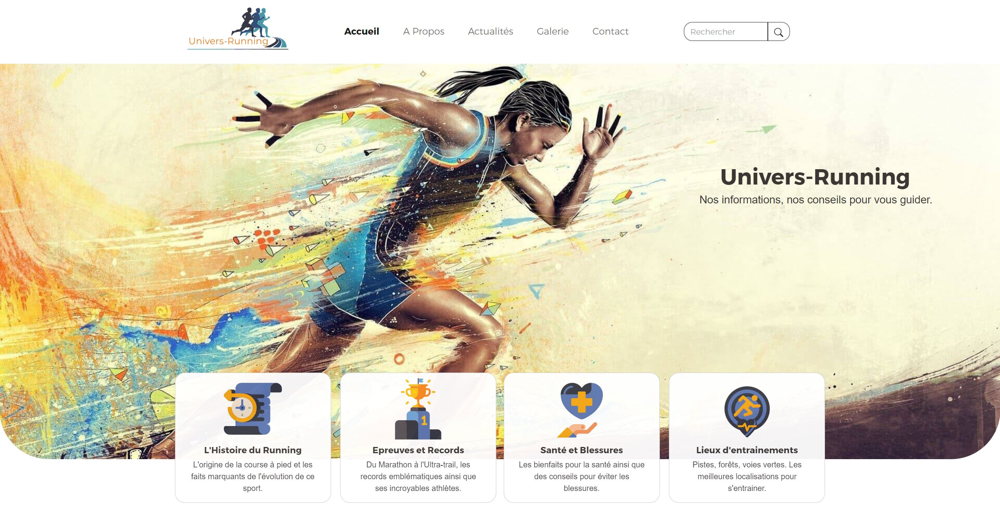

# Frontend Project - Univers-Running

## Welcome! 👋

Thanks for checking out this front-end personal project.

## The Project

It's my first personal project, it's a static website. I also made the graphic chart and the mockups with Adobe XD.
It's an informational website, where you can find news and informations about the running world.
There is also an advice page, to perform better and to avoid injuries.

Stacks used :
- HTML5
- CSS3
- JavaScript
- Bootstrap
- Adobe Suites

**Don't hesitate to contact me for further informations!** 🚀
